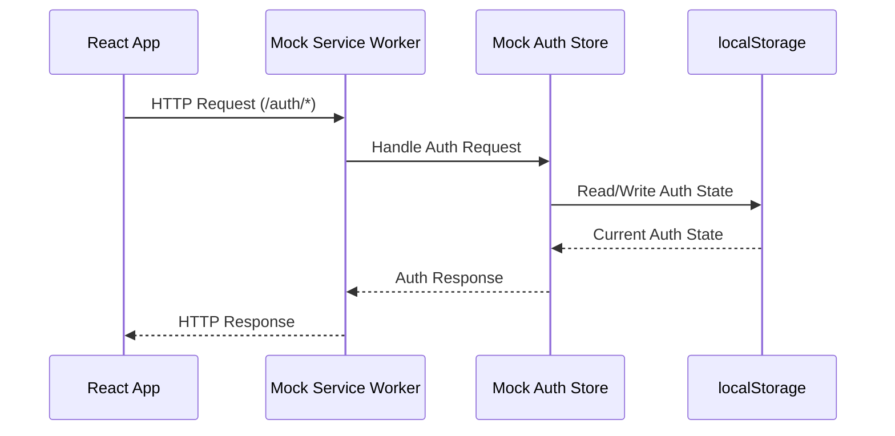

# Mock Authentication System

This document describes the mock authentication system used for development and testing of InSilico Strategy.

## Overview

The mock authentication system provides a way to develop and test authentication flows without requiring an external authentication service. It uses Mock Service Worker (MSW) to intercept HTTP requests and simulate a real authentication backend.

### Why Mock Authentication?

Development and testing of authenticated features typically requires:
- A running authentication server
- Test user accounts
- Network connectivity
- Session management

Our mock system eliminates these dependencies while maintaining realistic behavior, making it easier to:
- Develop features requiring authentication
- Test different authentication states
- Simulate edge cases and errors
- Run tests in CI environments

### Architecture

The mock system intercepts authentication-related HTTP requests using MSW and maintains authentication state in memory and localStorage:



## Implementation Details

### Key Files and Structure

```
src/
├── mocks/
│   ├── auth/
│   │   ├── mockUsers.js       # Mock user database
│   │   ├── mockAuthService.js # Auth state management
│   │   └── handlers.js        # MSW request handlers
│   ├── browser.js            # MSW browser setup
│   ├── setup.js              # Mock system initialization
│   └── test-utils.js         # Testing utilities
```

### Component Details

#### `mockUsers.js`
Defines the available mock users for testing and development. Each user has:
- Unique ID
- Email
- Name
- Role
- Any other required user properties

#### `mockAuthService.js`
Manages authentication state:
- Current user tracking
- Authentication status
- localStorage persistence
- Session management

#### `handlers.js`
MSW request handlers that simulate backend endpoints:
- `/auth/login` - User authentication
- `/auth/logout` - Session termination
- `/auth/principal` - Current user verification

#### `browser.js`
Configures MSW for browser environment:
- Sets up service worker
- Registers request handlers
- Configures MSW options

#### `setup.js`
Initializes the mock system:
- Checks for mock environment
- Starts MSW
- Configures logging
- Handles initialization errors

#### `test-utils.js`
Provides utilities for testing:
- User login/logout helpers
- Auth state management
- Test setup/teardown functions

## Development Usage

### Setup

1. Install dependencies:
```bash
npm install
```

2. Initialize MSW:
```bash
npx msw init public/
```

### Running with Mock Auth

Start the development server with mock authentication:

```bash
npm run dev:mock
```

### Available Mock Users

Default mock users:
```javascript
{
  regular: {
    email: 'test@example.com',
    password: 'password123'
  },
  admin: {
    email: 'admin@example.com',
    password: 'admin123'
  }
}
```

### Development Features

- Console indicators show when mock auth is active
- Network tab shows intercepted requests
- Auth state persists across refreshes
- Instant auth state changes

## Testing Usage

### Basic Auth Testing

```javascript
import { mockAuthUtils } from '../mocks/test-utils';

describe('Protected Component', () => {
  beforeEach(() => {
    mockAuthUtils.logout(); // Reset auth state
  });

  test('shows content when logged in', () => {
    mockAuthUtils.login();
    // Test authenticated state
  });

  test('redirects when logged out', () => {
    // Test unauthenticated state
  });
});
```

### Auth Utilities

```javascript
// Login as specific user
mockAuthUtils.loginAs('admin@example.com');

// Login as default test user
mockAuthUtils.login();

// Login as admin
mockAuthUtils.loginAsAdmin();

// Logout
mockAuthUtils.logout();

// Get current user
const user = mockAuthUtils.getCurrentUser();
```

### Testing Protected Routes

```javascript
import { render, screen } from '@testing-library/react';
import { mockAuthUtils } from '../mocks/test-utils';
import ProtectedRoute from './ProtectedRoute';

test('protected route redirects when not authenticated', () => {
  render(<ProtectedRoute />);
  expect(screen.getByText(/login required/i)).toBeInTheDocument();
});

test('protected route shows content when authenticated', () => {
  mockAuthUtils.login();
  render(<ProtectedRoute />);
  expect(screen.getByText(/protected content/i)).toBeInTheDocument();
});
```

## Best Practices

1. **Reset Between Tests**
   - Always reset auth state in `beforeEach`
   - Don't rely on auth state from previous tests

2. **Mock Conditionally**
   - Only enable mocks in development/test
   - Use environment variables to control mocking

3. **Error Handling**
   - Test both success and error cases
   - Simulate network failures
   - Test loading states

4. **Auth State**
   - Don't modify auth state directly
   - Use provided utilities
   - Check auth state when needed

## Troubleshooting

### Common Issues

1. **Mock not working**
   - Verify `REACT_APP_USE_MOCK_AUTH=true`
   - Check console for MSW initialization
   - Verify service worker registration

2. **Auth state inconsistent**
   - Clear localStorage
   - Reset auth state manually
   - Check browser console errors

3. **Tests failing**
   - Verify MSW setup in test environment
   - Check for auth state conflicts
   - Ensure proper test isolation

### Debug Tips

- Use browser dev tools to inspect requests
- Check localStorage for auth state
- Enable MSW logging for detailed info
- Use React dev tools to verify component state

## Contributing

When modifying the mock auth system:

1. Update tests when adding features
2. Document new utilities
3. Maintain realistic behavior
4. Consider edge cases
5. Update this documentation

## Future Improvements

Planned enhancements:

- [ ] Add request delay simulation
- [ ] Expand error scenarios
- [ ] Add more user types
- [ ] Improve debug logging
- [ ] Add performance monitoring

## Production Builds

The mock authentication system is strictly for development and testing. When building for production, you'll want to ensure all mock services are disabled and removed from the bundle.

### Automatic Mock Removal

The mock system is designed to be automatically excluded from production builds through several mechanisms:

1. **Environment Variables**
```bash
# Development with mocks
REACT_APP_USE_MOCK_AUTH=true npm start

# Production build (no mocks)
npm run build
```

2. **Code Splitting**
The mock system uses dynamic imports and is only loaded when explicitly enabled:
```javascript
if (process.env.NODE_ENV === 'development') {
  const { setupMocks } = await import('./mocks/setup');
  await setupMocks();
}
```

3. **Build Configuration**
The production build process:
- Removes dead code (mock imports)
- Eliminates development-only features
- Excludes test utilities
- Removes the service worker registration

### Deployment Checklist

Before deploying to production:

1. **Environment Setup**
   ```bash
   # Ensure no mock-related env vars are set
   unset REACT_APP_USE_MOCK_AUTH
   # Or explicitly disable
   REACT_APP_USE_MOCK_AUTH=false npm run build
   ```

2. **Build Verification**
   - Check bundle size and contents
   - Verify mock code is not included
   - Test authentication with real backend
   ```bash
   # Build and analyze bundle
   npm run build
   npx source-map-explorer build/static/js/*.js
   ```

3. **Service Worker Cleanup**
   - Remove mock service worker file
   ```bash
   rm build/mockServiceWorker.js
   ```

4. **Configuration Update**
   - Update API endpoints for production
   - Configure real authentication service
   - Update error handling

### Production Authentication Setup

Replace mock authentication with your real authentication service:

```typescript
// src/auth/services/Authenticator.js
class Authenticator {
  constructor(rootPath) {
    this.rootPath = rootPath;
    this.loginPath = process.env.REACT_APP_AUTH_PATH || '/auth/login';
    this.apiBase = process.env.REACT_APP_API_BASE || '';
  }

  async login() {
    // Real implementation
  }

  async logout() {
    // Real implementation
  }
}
```

### Environment Configuration

Create environment-specific configuration files:

```
.env.development
REACT_APP_USE_MOCK_AUTH=true
REACT_APP_API_BASE=http://localhost:8000

.env.production
REACT_APP_API_BASE=https://api.example.com
```

### Build Scripts

Update package.json to include production build commands:

```json
{
  "scripts": {
    "build:prod": "REACT_APP_USE_MOCK_AUTH=false npm run build",
    "deploy:prod": "npm run build:prod && ./deploy-script.sh"
  }
}
```

## Additional Resources

- [MSW Documentation](https://mswjs.io/)
- [Testing Library Guides](https://testing-library.com/docs/)
- [React Testing Best Practices](https://reactjs.org/docs/testing.html)
- [Create React App Production Build](https://create-react-app.dev/docs/production-build/)
- [Environment Variables](https://create-react-app.dev/docs/adding-custom-environment-variables/)
